# 페르소나 선정

> 페르소나를 선정하고, 각 페르소나의 선호 카테고리를 선정했습니다.
>
> SSAFY에서 제공해준 카드사 데이터에서 성별/연령별 선호 업종을
> 토대로 선호 카테고리를 설정했으며, 관련 데이터를 첨부했습니다.
>
> 저희 사이트에 사용자가 몰릴것으로 예상되는 20대의 경우 조금 더 다양하게 나눴습니다...

## 남성

### 남성 10대

> 압도적인 (98%이상) 결제건수를 기록한 비디오방/게임방을 제외한 그래프입니다.
>
> 컴퓨터기기 / 문방구점 / 서점 / 기성복점에서 많은 소비가 일어납니다.
>
> 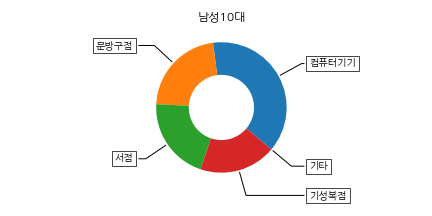

### 남성 20대

> 마찬가지로 압도적인 (91%이상) 결제건수를 기록한 비디오방/게임방을 제외한 그래프입니다.
>
> 기성복점/화장품점/문방구점/완구점에서 많은 결제건수를 기록했습니다.
>
> 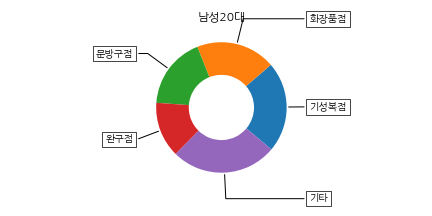

### 남성 30대

> 비디오/게임방 / 기성복점 / 문방구점 / 서점 / 가전제품점
>
> 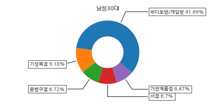

### 남성 40대

> 서점 / 학습지 / 문방구 / 기성복점 / 문리계학원
>
> 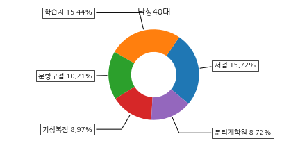

### 남성 50대

> 서점 / 기성복점 / 문방구점 / 가전제품점
>
> 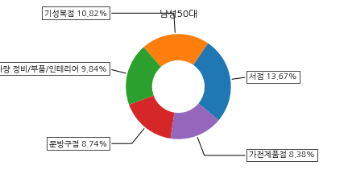

### 남성 60대

> 가전제품점 / 서점 / 차량 정비 / 문방구 / 기성복
>
> 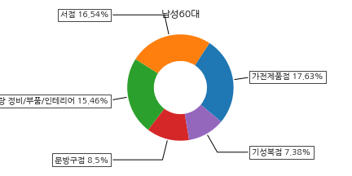

### 남성 70대 이상

> 가전제품 / 서점 / 문방구 / 문화센터 / 골프장
>
> 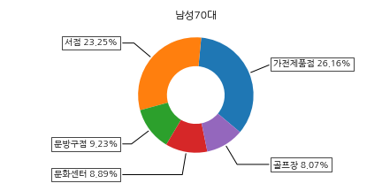

## 여성

### 여성 10대

> 비디오/게임방 / 화장품점 / 문방구점 / 기성복점 / 악세사리점
>
> 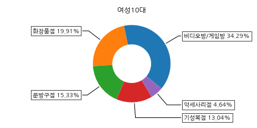

### 여성 20대

> 화장품 / 비디오/게임 / 기성복 / 문방구 / 악세서리
>
> 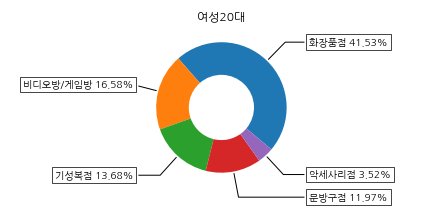

### 여성 30대

> 화장품 / 기성복 / 서점 / 문방구 / 학습지
>
> 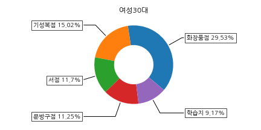

### 여성 40대

> 서점 / 화장품 / 기성복 / 학습지 / 문방구
>
> 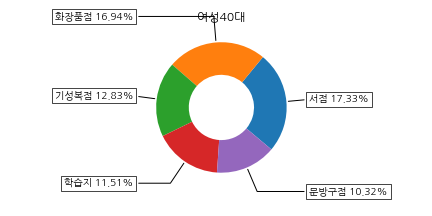

### 여성 50대

> 기성복 / 화장품 / 가전제품 / 서점 / 스포츠용품
>
> 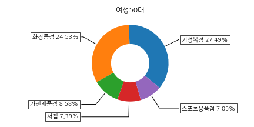

### 여성 60대

> 기성복 / 화장품 / 가전제품 / 스포츠용품 / 서점
>
> 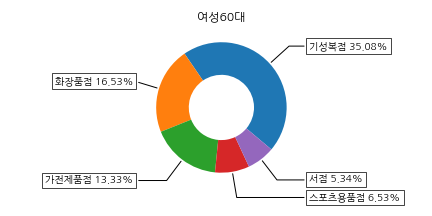

### 여성 70대 이상

> 가전제품 / 종합스포츠센터 / 기성복 / 화장품 / 문화센터
>
> 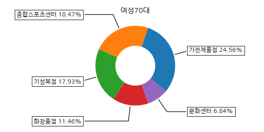

## 페르소나 정리

### 남성

|  연령대   |    메인 컨셉    | 메인 관심 | 서브 관심 1 | 서브 관심 2 |
| :-------: | :-------------: | :-------: | :---------: | :---------: |
|   10대    |    전교 1등     |   도서    |    문구     |    운동     |
|   10대    |    스포츠맨     |   운동    |    패션     |    도서     |
|   10대    |     패션왕      |   패션    |    악기     |    운동     |
|   10대    |     겜돌이      |   게임    |   컴퓨터    |      -      |
|   20대    |     패션왕      |   패션    |    뷰티     |    레저     |
|   20대    |     너드..?     |  디지털   |    도서     |      -      |
|   20대    | 교수님의 수제자 |   도서    |    패션     |   디지털    |
|   20대    |    우우운동     |   운동    |    레저     |    패션     |
|   20대    |        -        |   ????    |             |             |
|   30대    |    겜돌이...    |  디지털   |  가전제품   |    도서     |
|   30대    |    자기개발     |   서점    |    의류     |   디지털    |
|   30대    |    아버지..?    |  유아동   |    가전     |    가구     |
|   40대    |    자기개발     |   서점    |    패션     |    레저     |
|   40대    |    집꾸미기     |   가구    |    가전     |   디지털    |
|   40대    |     아버지      |   도서    |   디지털    |  생활/건강  |
|   50대    |    자기개발     |   도서    |    의류     |      -      |
|   50대    |    집꾸미기     |   가구    |    가전     |    도서     |
|   50대    |   스포츠/레저   |   레저    |   스포츠    |    건강     |
|   60대    |     집 관리     |   가구    |    가전     |    건강     |
|   60대    |    건강관리     |   레저    |    건강     |    도서     |
|   60대    |   스포츠/레저   |   레저    |   스포츠    |    건강     |
| 70대 이상 |    집꾸미기     |   가구    |    가전     |    도서     |
| 70대 이상 |    학습/손주    |   도서    |    육아     |      -      |
| 70대 이상 |   스포츠/레저   |   레저    |    건강     |      -      |

### 여성

|  연령대   |  메인 컨셉  |  메인 관심  | 서브 관심 1 | 서브 관심 2 |
| :-------: | :---------: | :---------: | :---------: | :---------: |
|   10대    |    게임     |   디지털    |    도서     |      -      |
|   10대    |   패션왕    |    패션     |    뷰티     |    도서     |
|   10대    |  전교 1등   |    도서     |    문구     |   디지털    |
|   10대    |   ..운동?   |    운동     |    패션     |    도서     |
|   20대    |  패션/뷰티  |    패션     |    뷰티     |      -      |
|   20대    |  자기개발   |    도서     |    패션     |   디지털    |
|   20대    | 얼리어답터  |   디지털    |    패션     |    도서     |
|   20대    |    게임!    |   디지털    |    도서     |    뷰티     |
|   20대    |   스포츠    |   스포츠    |    생활     |    레저     |
|   30대    |  패션/뷰티  |    패션     |    뷰티     |    도서     |
|   30대    |  자기개발   |    도서     |    패션     |    레저     |
|   30대    |   어머니    |    육아     |    도서     |    패션     |
|   40대    |  자기개발   |    도서     |    패션     |    레저     |
|   40대    |  패션/뷰티  | 패션(남/녀) |    뷰티     |    도서     |
|   40대    |  집꾸미기   |    가구     |    가전     |    도서     |
|   50대    |  패션/뷰티  | 패션(남/녀) |    뷰티     |    가구     |
|   50대    |   집 관리   |    가구     |    가전     |    생활     |
|   50대    | 스포츠,레저 |    레저     |   스포츠    |    건강     |
|   60대    |    의류     |    의류     |    잡화     |    가구     |
|   60대    |   어머니    |    도서     |    의류     |    잡화     |
|   60대    | 스포츠,레저 |    레저     |    건강     |    도서     |
| 70대 이상 |  집꾸미기   |    가구     |    가전     |    도서     |
| 70대 이상 |  학습/손주  |    도서     |    육아     |      -      |
| 70대 이상 | 스포츠,레저 |    레저     |    건강     |      -      |

## 데이터 생성 방법

1. 각 페르소나별로 카테고리 선정 (메인 / 서브1 / 서브2로 분류)
2. 각 페르소나별로 20명 가량의 가상 User 생성
3. 각각의 User는 각각의 Category에 대해 랜덤한 범위의 값을 가지도록 설정 (8이내 / 5이내 / 3이내)
4. 아마도 총 유저는 900명 예상 / 카테고리는 423개 => (modeling을 위해 타협)
5. 테스트를 위해 outlier도 임의로 생성할 것

## 기본 -> 협업 전환 타이밍 계산

1. Model이 완성된 후
2. 가상의 User 생성
    1. 카테고리별 조회 수를 +1
    2. 새로운 카테고리의 조회 수를 +1
3. 그러다보면 언젠가 협업 필터링으로 계산한 예측값의 Error와 기초 시스템의 Error가 비슷해지겠죠.?
4. 최종적으로는 N개 이상의 카테고리에서 M번 이상 조회하면....???

## 추가 고려 사항 - 선호 카테고리

### 1. 1 회원가입 시 선호 카테고리를 입력

> 위 방법을 통해 연관된 카테고리들 사이는 어느정도 연결이 되었지만,
> 같은 대분류 (11개) 내의 카테고리들은 조금 더 강하게 연결해야될 것같다는 생각을 하게 되었습니다.
>
> 그래서 생각한 아이디어입니다.

### 1.2 특정 대분류의 항목들을 균일하게 조회한 가상 User 생성

이 과정을 통해 특정 대분류 내의 각 카테고리들은 더 강한 연결관계를 가지게 될 것입니다.

그리고 추천할 때 성별, 연령과 더불어 선호카테고리를 포함한다면

조금 더 세부적인 무언가를 추천할 수 있지 않을까요....