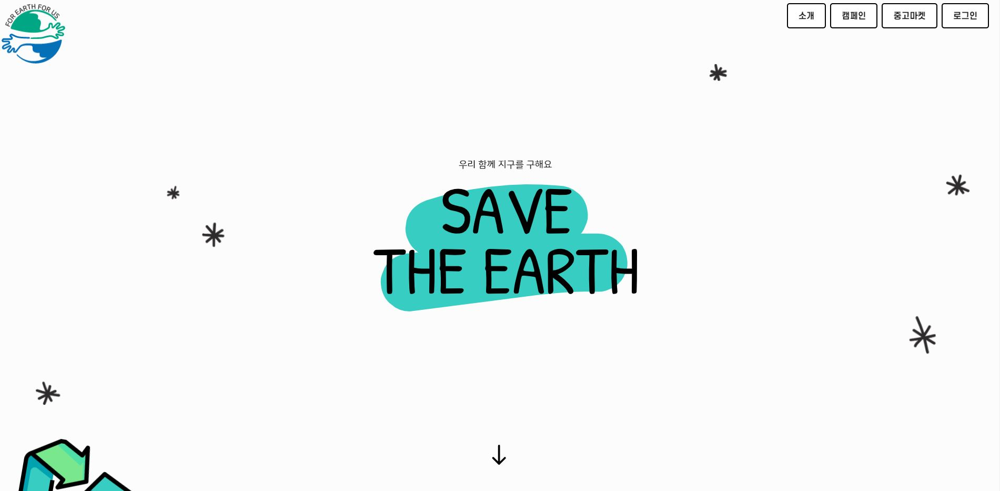
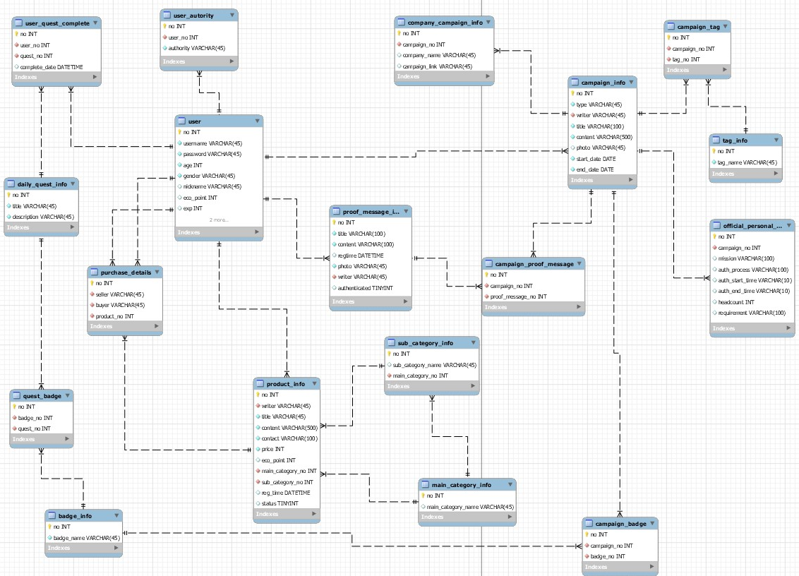
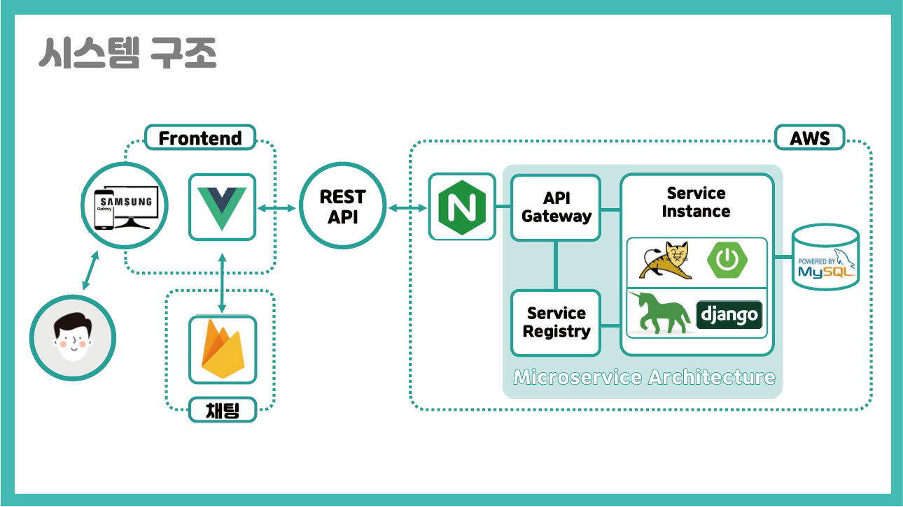

<div align=center></div>

<h2 align=center>A402 - Among Earth</h2>

<div align=center>
    
    
    
    
    
    
    
    
</div>


<a href="http://j3a402.p.ssafy.io/" align=center><h3>FEFU 바로가기</h3></a>

<a href="document/DEMO.md" align=center><h3>Demo 바로가기</h3></a>

<div align=center>
    캠페인 기능을 활용하여 다른 사용자들과 함께 환경을 지키기위한 노력을 계속할 수 있습니다.<br>
    캠페인 활동을 통해 얻은 에코포인트를 활용하여 중고물품을 저렴하게 구입하며,<br>
    함께, 그리고 지속 가능한 환경 보호 활동을 할 수 있을 것입니다.
</div>


## :book: 목차

### :earth_asia: [프로젝트 소개](#프로젝트-소개)

### :gear: [환경 보호 준비 과정](#환경-보호-준비-과정)

- ERD 소개
- 시스템 구성도 소개
- 기타 (와이어프레임 / API 문서 / 추천 시스템 소개)

### :package: [환경 보호 수단](#환경-보호-수단)​

* Frontend / Backend의 사용 Package
* 코드 실행 방법

### 🍀 [크루원 소개](#크루원-소개)


## 프로젝트 소개

> **For Earth, For Us**
>
> 자연과 공존할 수 있는 삶터를 지키고 행복한 미래를 만들어 가는 녹색의 길에서
>
> 지구 그리고 당신과 함께 하겠습니다.

지구의 날은 1970년 부터 시작되었고, 올해로 50주년을 맞이했습니다.

저희 FEFU는 지구의 날 50주년을 맞이하여 환경 보호에 대한 중요성을 다시 한번 상기하고자 합니다.

FEFU를 통해 사람들은 함께, 그리고 지속적으로 환경 보호 활동에 참여할 수 있을 것이고,

모두를 위한 아름답고 건강한 미래를 실현할 수 있을 것입니다.  


## 환경 보호 준비 과정
### ERD

> 회원, 캠페인, 중고마켓의 기능이 유기적으로 연결되어있고,
>
> 그를 효율적으로 활용하기 위해 ERD를 작성했습니다.




### 시스템 구성도

> 저희는 Spring boot와 Django를 활용한 MSA를 구축했습니다.
>
> 사용자의 클라이언트에서 요청을 보낼 경우 Spring의 Gateway를 통해
>
> 적절한 백앤드 서버로 전달하고, 각각의 백앤드 서버에서 요청을 처리해서 응답을 보내줍니다.
>
> 회원 관리, 캠페인 기능은 Spring boot로 구성된 백앤드 서버에서 처리했고,
>
> 추천 기능이 들어간 중고마켓 기능은 Django로 구성된 백앤드 서버에서 처리했습니다.




### 기타

[와이어 프레임](document/wire_frame.md)

[API Documentation](document/REST_API_document.md)

[추천 시스템 구성 방법](document/recommendation_summary.md)


## 환경 보호 수단

### Frontend Package

|          Package          |    Version     | Comment                                           |
| :-----------------------: | :------------: | :------------------------------------------------ |
|        vue-router         |     3.2.0      | 요청 URL에 따라 브라우저에서 돔을 변경            |
|           vuex            |     3.5.1      | 상태 관리 패턴 + 라이브러리                       |
|           axios           |     0.19.2     | REST API 서버로부터 데이터를 받아오기 위해 사용   |
| bootstrap / bootstrap-vue | 4.5.0 / 2.15.0 | 프론트엔드 디자인을 효율적으로 진행하기 위해 사용 |
|          vuetify          |     2.3.8      | Calendar 요소 사용                                |
|  chart.js / vue-chartjs   | 2.9.3 / 3.5.0  | 데이터를 시각화하여 보여주기 위해 사용            |
|       scrollmonitor       |     1.2.4      | 무한스크롤을 구현하기 위해 사용                   |
|          lodash           |    4.17.19     | 요리대전의 순서를 랜덤으로 섞기위해 사용          |

### Backend Package

|    Package     | Version | Comment                                                      |
| :------------: | :-----: | :----------------------------------------------------------- |
| OpenJDK - zulu |  8.33   | 프로젝트의 Java vendor로써 사용                              |
|   SpringBoot   |  2.3.1  | Java의 서버 개발 환경을 구성하기 위해 사용                   |
|      JWT       |  0.9.1  | 클라이언트와 서버의 stateless 환경 구성을 위해 사용          |
|    MariaDB     | 10.5.4  | 프로젝트의 DB vendor로써 사용                                |
|    MyBatis     |  2.1.2  | 서버와 DB의 연동을 위해 사용                                 |
|     Lombok     | 1.18.10 | Annotation을 이용한 코드 생성으로 가독성 & 유지 보수를 위해 사용 |
|    Swagger     |  2.9.2  | API 스펙 문서의 자동화를 위해 사용                           |
|     Nginx      | 1.14.0  | 서버 배포를 용이하게 하기 위해 사용                          |
|      pm2       |  4.4.0  | 서버의 무중단 배포를 위해 사용                               |

### 코드 실행 방법

### Preparation

- Please must install Java 1.8  or even higher version

- install Node.js / NPM

- Clone Repository

    ```
    git clone https://lab.ssafy.com/s03-webmobile1-sub3/s03p13a104.git
      
    cd s03p13a104
    ```

### Installation

- Build front-end environment & run front-end server

    ```
    cd s03p13a104/frontend
    
    yarn install 
    
    yarn serve --port 3000
    ```

- Build back-end & run back-end server

    ``` 
    mvn clean package
    
    java -jar target/cookblog-0.0.1-SNAPSHOT.war
    ```

- Use Nginx & pm2

    ``` 
    pm2 start co-ok
    ```


## 크루원 소개

### 🍀 Among Earth 팀

* **권경은** - *PM, backend*- [chriskwon96](https://lab.ssafy.com/chriskwon96)
* **김현수** - *backend* - [gustn16113](https://lab.ssafy.com/gustn16113)
* **박지윤** - *frontend* - [bellnuite](https://lab.ssafy.com/bellnuite)
* **박태록** - *frontend* - [sdf7575](https://lab.ssafy.com/sdf7575)
* **이동혁** - *data analysis* - [lee33843](https://lab.ssafy.com/lee33843)


### Git Branch 전략

### branch

```bash
(master) -> (develop) -> (develop-front / back / data) -> (feature/feature명)
```

* master : 배포 가능한 상태로 유지
* develop : 개발용 최상위 branch
* front / back / data
    * front : Frontend 개발 branch
    * back : Backend 개발 branch
    * data : 데이터 분석 개발 branch
* Fetaure : 기능별 branch
* Hotfix : 급한 버그 수정이 필요한 경우 버그 수정 branch

### commit

```bash
[이름] Feature / 행위 + 설명 으로 구성
    예시]
        [LDH] Login / FIX bugs from login modal
        [LDH] README / ADD README.md
```

### merge

```bash
merge 하기 전에 현재 작업 진행 상황 공유
merge 권한은 모두가 가지고 있지만 같은 팀의 다른 사람에게 리뷰 신청 후 merge 하기
merge 후 불필요한 branch 지우기
```

