<h1 align=center>FEFU Demo</h1>

> For Earth, For Us (FEFU) 의 데모 페이지입니다.

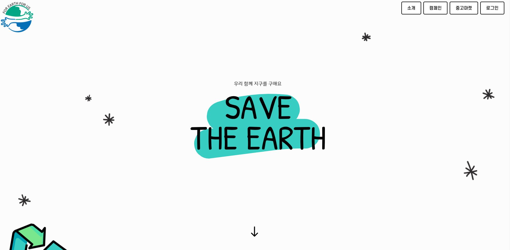

## :book: 목차

### 1. [메인 페이지](#메인-페이지)

### 2. [캠페인](#캠페인)

### 3. [중고마켓](#중고마켓)

### 4. [마이 페이지](#마이-페이지)

## 메인 페이지

> FEFU의 메인 페이지입니다.

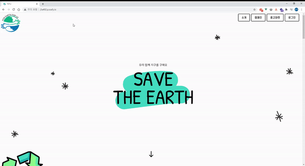

메인 페이지에서는 FEFU의 목적과 기능에 대해 간략하게 소개합니다.

1. 함께 참여할 수 있는 다양한 환경 보호 캠페인
2. 환경을 보호하는 '재사용' - 중고마켓
3. 같은 목표를 위해 일하는 환경 단체 소개

## 캠페인

> 다른 사용자와 함께 환경보호라는 공동의 목표를 달성하기 위해 캠페인을 진행할 수 있습니다.
>
> 총 3가지 캠페인과 일상 속에서 환경 보호를 위해 노력할 수 있는 일일퀘스트 탭이 있습니다.

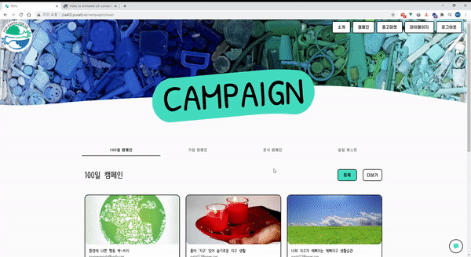

### 1. 100일 캠페인

* 유저들이 직접 등록한 캠페인으로, 100일동안 진행되는 캠페인입니다.

* 캠페인 등록 버튼을 통해 유저가 원하는 캠페인을 등록하고, 다른 유저와 함께 100일동안 진행할 수 있습니다.

* 인증 현황 탭에서는 캠페인 팀원들의 인증 일수를 확인할 수 있으며,

    인증 게시글 탭에서는 승인된 인증 게시글을 볼 수 있습니다.

* 인증 현황 탭 화면

    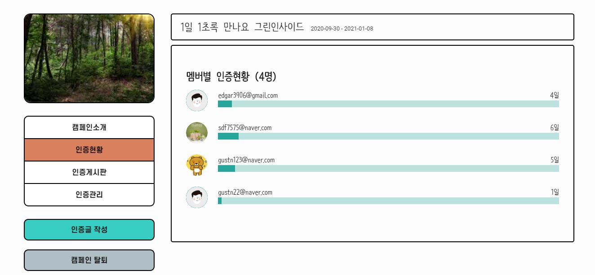

* 인증 게시글 작성 화면

    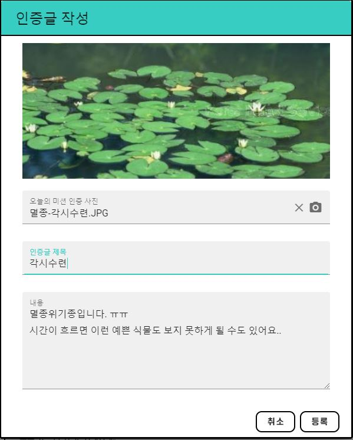

* 인증 게시글 승인 화면 (괸리자)

    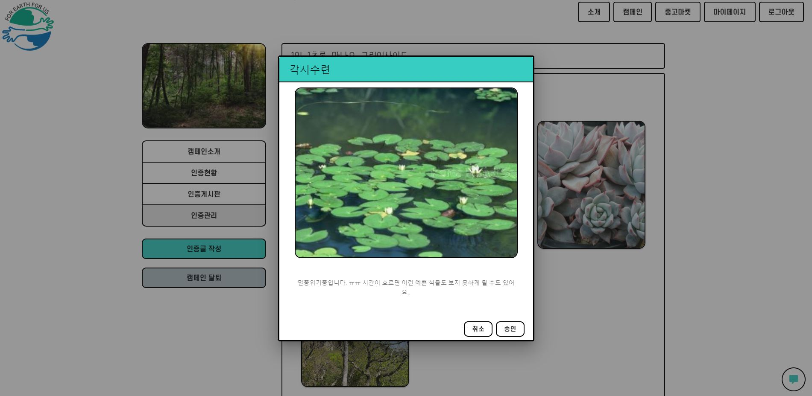

### 2. 기업 캠페인

* 기업들이 진행하는 캠페인에 대한 정보를 공유하기 위한 탭입니다.
* 사이트의 운영자들이 기업에서 진행하는 캠페인에 대한 정보를 공유해드립니다!

### 3. 공식 캠페인

* 사이트의 운영자들이 생성한 캠페인으로, 특정 기간동안 진행되는 캠페인입니다.

* 인증 현황 탭에서는 전체 팀원들의 날짜별 인증 현황을 확인할 수 있으며,

    인증 게시글 탭에서는 승인된 인증 게시글을 볼 수 있습니다.

* 인증 현황 탭

    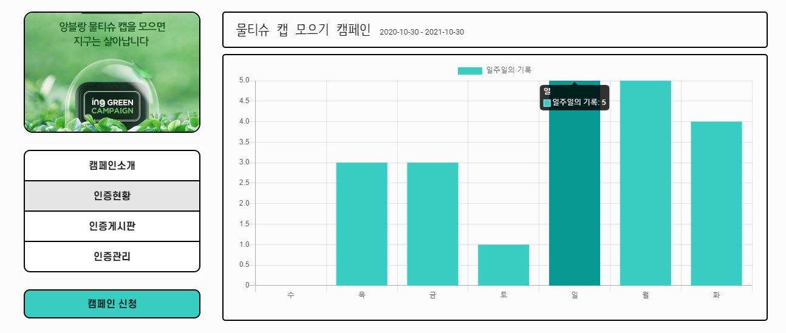

### 4. 일일 퀘스트

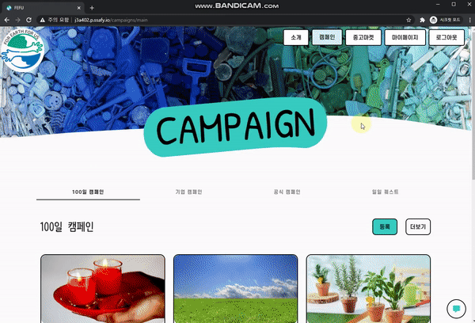

## 중고마켓

> 가장 좋은 환경 보호 방안은 새로운 제품을 구매하지 않는 것일수도 있습니다.
>
> 자신이 안 쓰는 물건을 다른 사람에게 판매한다면
>
> 새로운 제품을 생산하며 생기는 환경 오염을 방지할 수 있을 것입니다.
>
> 또한, 추천 시스템을 통해 사용자에게 적절한 카테고리의 물품을 추천하기도 합니다!

중고마켓의 첫 화면은 총 3개의 섹션으로 이루어져 있습니다.

1. 이 상품 어때요?

    사용자의 물품 조회 기록을 기준으로 추천 카테고리를 선정하고, 적절한 제품을 추천합니다.

2. 지금 바로 신상품

    새로 등록된 상품들에 대한 정보를 보여줍니다.

3. 지금 인기 상품

    최근 가장 많이 조회된 물품을 보여줍니다.

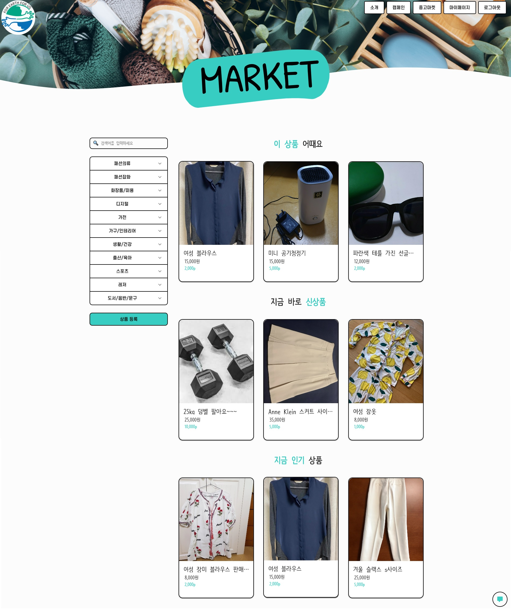

### 1. 물품 검색

* 원하는 카테고리의 제품을 조회할 수 있습니다.
* 또한, 검색을 통해 제품의 이름으로 검색할 수 있습니다!

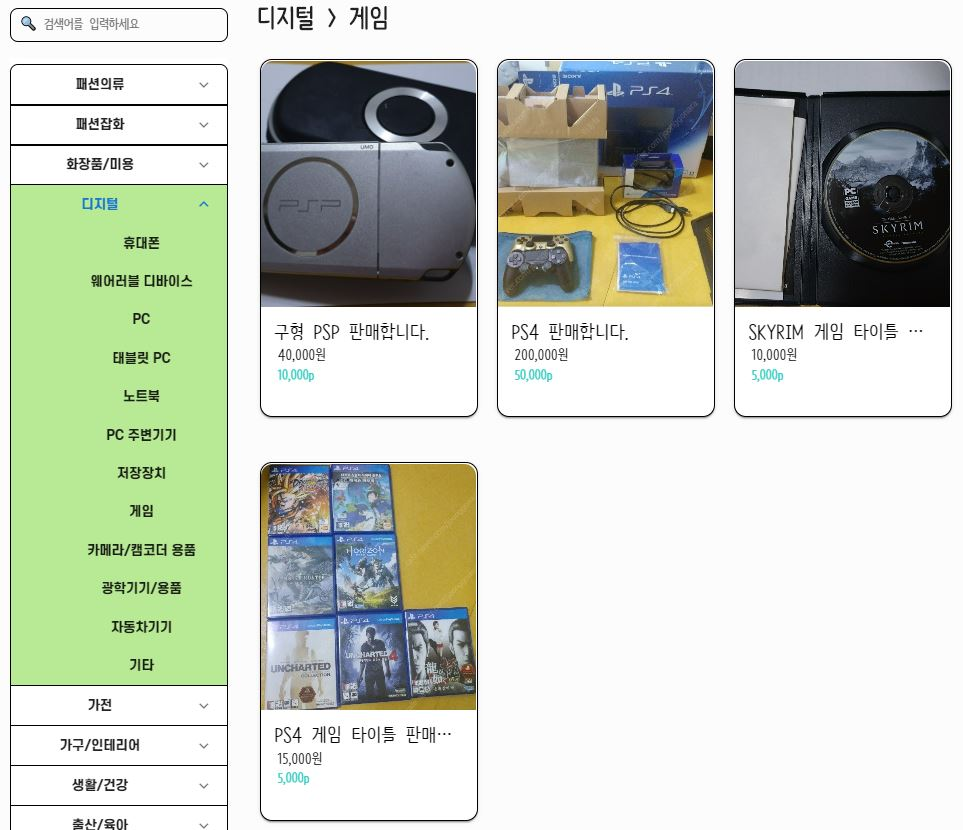

### 2. 물품 등록하기

* 판매하고자 하는 중고거래 물품을 등록할 수 있습니다.
* 물품 등록 시 자동으로 해당 제품에 대한 단체 채팅방이 생성됩니다.

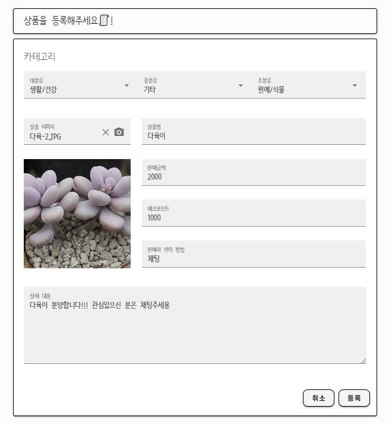

### 3. 물품 상세정보

* 판매 물품에 대한 상세정보를 볼 수 있습니다.

* 같이 보면 좋을 상품에는 해당 제품의 카테고리와 연관성이 높은 카테고리의 제품이 출력됩니다.

    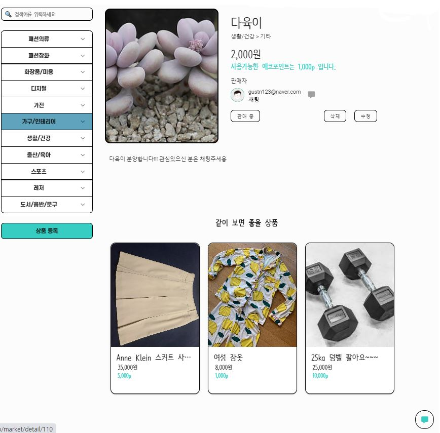

* 다음과 같은 순서로 물품을 구매할 수 있습니다.

    1. 판매자 연락처 혹은 채팅 입장 버튼을 통해 판매자와 연락합니다.

        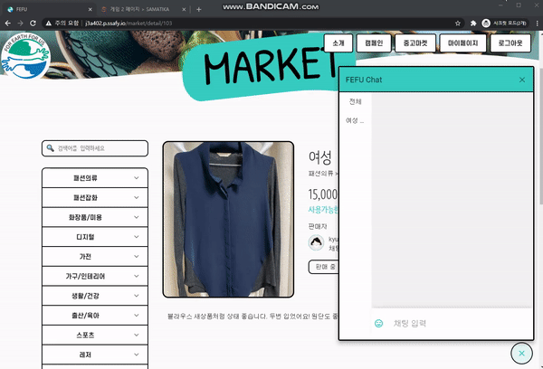

    2. 판매중 버튼을 눌러서 판매자에게 에코포인트를 전송하고, 거래를 진행합니다.

    3. 판매자는 마이페이지 - 에코포인트 거래내역을 확인 후 상품을 판매 완료 상태로 전환합니다.

## 마이 페이지

> 사용자의 활동 내역을 확인할 수 있는 페이지입니다.
>

### 1. 내 정보

* 자신의 정보를 보고, 수정할 수 있습니다.
* 프로필 사진 아래에서는 자신의 경험치와 에코포인트를 확인할 수 있습니다.

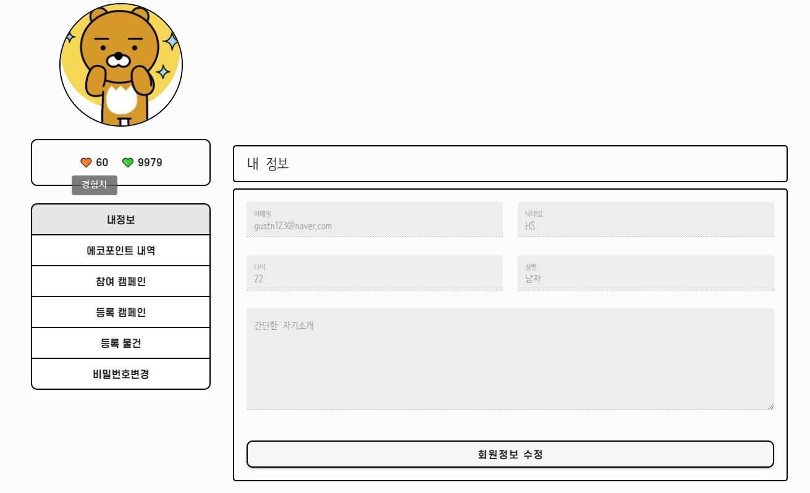

### 2. 에코포인트 내역

* 에코포인트를 전달받은 내역을 확인할 수 있습니다.
* 보낸유저의 아이디를 클릭하여 아이디를 클립보드에 복사할 수 있습니다. 

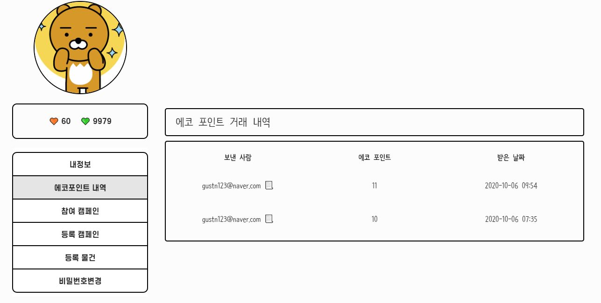

### 3. 참여 / 등록 캠페인, 등록 물건

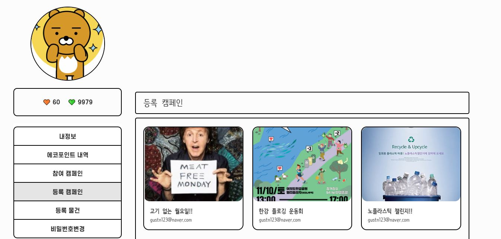

